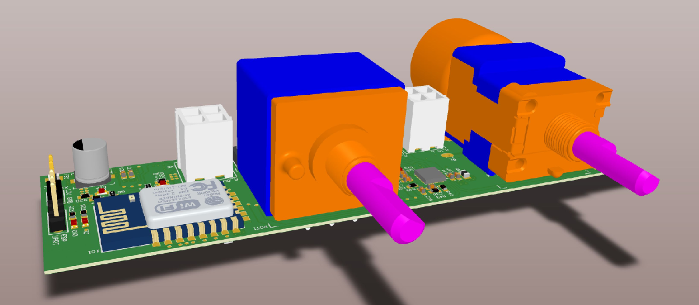
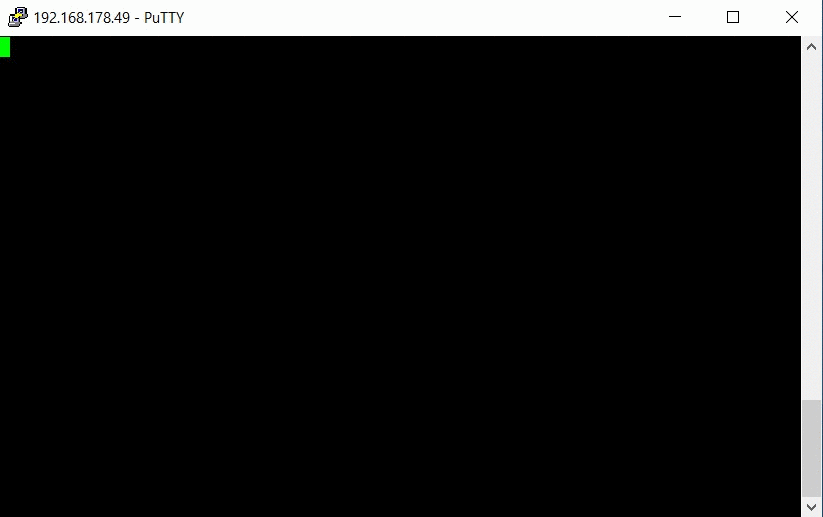
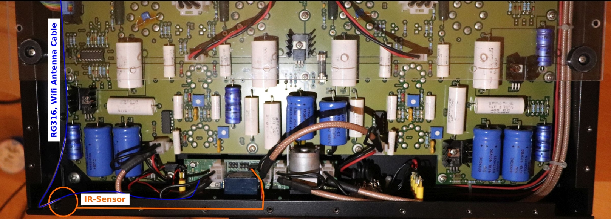
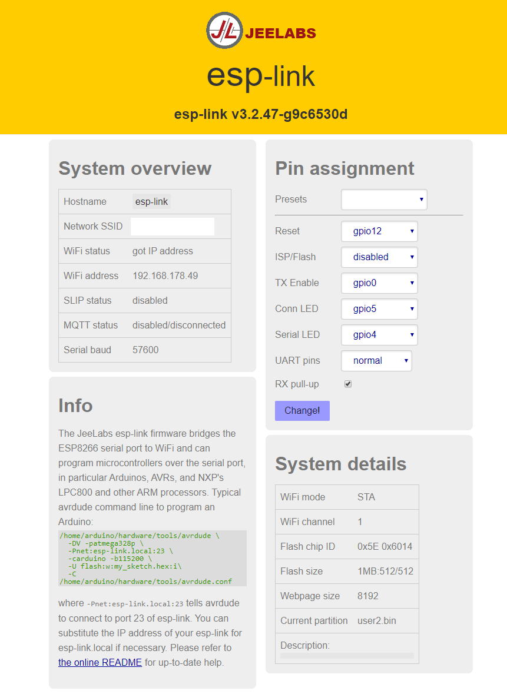

# BC2_VolCtrl PCB and FW



> The BC2_VolCtrl PCB implements a universal volume control based on the popular ALPS RK168 motor potentiometer. Balance setting is available via knob control only. The volume can be controlled via
>
> - The old school way, turning the knob
>
> - Standard infrared remote controls (several IR protocols)
> - A telnet interface (Wi-Fi)
>
> The PCB was designed as an upgrade for the Black Cat 2 audio tube amplifier. As the design of the PCB is universal, it may be integrated in other do-it-yourself amplifier projects easily.
>
> The amplifier itself was designed by  Henry Westphal and his students at the technical university of Berlin in Germany. Schematic and documentation are available [here](https://www.emsp.tu-berlin.de/menue/studium_und_lehre/mixed_signal_baugruppen_alt/das_projekt_black_cat/) (only German). 
>

## **Document link list**

- [Schematic](PCB/PDF/BC2_VolCtrl_Schematic.pdf)
- [Bill of Materials (BOM)](PCB/BOM/BOM.xlsx)
- [Board](PCB/PDF/BC2_VolCtrl_PCB.pdf)
- [Board Stack](PCB/PDF/BC2_VolCtrl_Board_Stack.pdf)
- [BOM Assembly](PCB/BOM/AssemblyTOP_BOT.xlsx)
- [Assembly drawing](PCB/PDF/BC2_VolCtrl_Assembly.pdf)
- [Gerber](PCB/Gerber)
- [NC Drill](PCB/NC_Drill)
- [3D-Model (*.step)](PCB/VolCtrl_PCB.step)

## **Table of Contents**

- [Features](#Features)
- [Description](#Description)
- [Manufacturing](#Manufacturing)
- [Things to consider for integration](#Things-to-consider-for-integration)
- [Black Cat 2 integration](#Black-Cat-2-integration)
- [First time setup](#First-time-setup)
- [Known issues](#Known-issues)
- [License](#License)

## **Features**

#### Basic Functions

- Motor potentiometer for a complete analog signal chain
- Balance setting via knob control
- Simultaneous use of multiple IR-Remotes (i.e. control via both: TV and CD-Player remotes )
- Support of multiple IR-protocols (Sony, NEC, RC5, ...)
- Position recognition of volume potentiometer
- Set-up via a simple command based telnet Wi-Fi connection
- Volume control via a telnet Wi-Fi connection (App. required)
- ESP-Link firmware with all features on the ESP8266 - Wi-Fi module

#### Circuit Design 

- LT3622 wide Vin step down converter (designed for VCC=12V)
- ATmega 328pb Atmel microcontroller
- UART-1 and one GPIO available at external connector (unsed)
- Black-Cat 2 tube amp compatible connectors and layout
- Farnell bill of materials
- Tested with external TSOP4838 IR-Receiver
- External Wi-Fi Antenna required

## Description

### IR Protocols and Remotes

The firmware uses the awesome [IRMP (Infrared Multiprotocol Decoder)]( https://www.mikrocontroller.net/articles/IRMP_-_english#top) library written by Frank Meyer. The library is able to decode several infrared protocols (refer to IRMP documentation for a complete list). Most of the IR-protocols have a unique start bit timing which IRMP uses to distinguish different protocols. 

To enable or disable protocols edit /FW/IMRP/irmpconfig.h. Every protocol will require a few bytes of RAM on the microcontroller. By default the most common IR-protocols are enabled:

```c
#define IRMP_SUPPORT_SIRCS_PROTOCOL         1    // Sony SIRCS         ~150 bytes
#define IRMP_SUPPORT_NEC_PROTOCOL           1	 // NEC + APPLE        ~300 bytes
#define IRMP_SUPPORT_SAMSUNG_PROTOCOL       1	 // Samsung + Samsg32  ~300 bytes
#define IRMP_SUPPORT_KASEIKYO_PROTOCOL      1	 // Kaseikyo           ~250 bytes
#define IRMP_SUPPORT_RC5_PROTOCOL           1	 // RC5                ~250 bytes
#define IRMP_SUPPORT_RCII_PROTOCOL          1	 // RCII T+A           ~250 bytes
```

Some IR-Remotes i.e. from CD-Players use different protocols for the majority of function keys and volume controls. For example a camebride audio CD-player remote uses the camebrige protocol for all function keys and the RC5 protocol for the volume up an down keys. 

The versatile IRMP library enables the BC2_VolCtrl to work with almost any IR remote. You can use any free key on one of the existing remotes that are already on your coffee table to control the volume. Use the 'regrem' Telnet command to register a new key of your remote to execute any of the commands specified below with a button press. 

For example you may register two keys on your TV remote with the `volup/voldown` commands. You can do the same with your CD-Player remotes. This enables the user to control the volume via two independent IR remotes (TV and CD-Player remote). A third key may be registered with the `setvol 0` command to implement a basic 'mute' function.

### Basic Operating Description

The turning of the volume potentiometer is defined by timings. If i.e. the user enters a `volup/voldown` cmd via telnet or a keypress on a registered IR-remote is recognized  a timer is started and the potentiometer starts rotating. The timer will run until the time specified by 'increment duration' is exceeded.  After this period of time the timer disables itself and stops the motor. This cycle is named 'one volume increment'. 

If the user sends another`volup/voldown` request while the potentiometer is still turning the timer gets reset and the inc duration time start from the beginning. This prevents the motor from stopping when the user holds a key down.

However this behavior assumes that the update rate of the remote control is faster than the time specified by the increment duration. If this is not the case the motor movement won´t be continuous when the user holds down a volume control button. By default the increment duration is set to 150ms. With this value I found the volume step resolution to be sufficiently small. The update rate of all tested remotes were faster than 1/150ms. I measured  approx. 1/115ms update rate on my remotes.


The Telnet Wi-FI connection of the BC2_VolCtrl PCB is handled by a ESP8266-07 with [ESP-LINK]( https://github.com/jeelabs/esp-link) firmware. ESP-LINK implements a Wi-Fi telnet to Serial bridge which enables the communication with the ATmega 328pb microcontroller. 

As the installation location of the module is at the front panel near a large metal plate and the case of a audio amplifier may be a metal enclose the Wi-Fi signal reception would be poor. Further on the small outline of the PCB prevents sufficient GND spacings for the ESP8266´s PCB antenna which further degrades RF performance. Therefore a ESP8266-07 module with exposed U.FL antenna connector for a external antenna was chosen. In this way the RF performance is independent of the installation location of the BC2_VolCtrl PCB. The downside is of course the requirement for an external Wi-Fi antenna.

### Telnet Command Set

|   Command   |          Args.           |    return     | Description                                                  |
| :---------: | :----------------------: | :-----------: | :----------------------------------------------------------- |
|   `volup`   |           N/A            |      N/A      | Turns the potentiometer one volume increment clockwise.      |
|  `voldown`  |           N/A            |      N/A      | Turns the potentiometer one volume increment counterclockwise. |
|  `setvol`   |       value, [int]       |      N/A      | Sets the pot. to a percentage defined by value (0...100%),   |
|  `showrem`  |           N/A            | table char[ ] | Returns a table, containing all registered remotes keys with indexes and commands. |
|  `regrem`   | desc, cmd, args, char[]  |  user instr   | Starts the register new remote key procedure with instructions with a function specified by cmd |
|  `delrem`   | remote ctrl.  idx, [int] |      N/A      | Deletes the remote key specified by idx                      |
| `getadcval` |           N/A            |  value [int]  | Returns the current value of the position ADC (for debugging) |
| `setincdur` |        dur, [int]        |      N/A      | Sets the volume increment duration time in ms                |
| `getincdur` |           N/A            |      N/A      | Returns the volume increment duration time in ms             |
| `set5vled`  |       state, [0,1]       |      N/A      | Enables (1) or disables (0) the 5V power rail indicator led  |
| `set3v3led` |       state, [0,1]       |      N/A      | Enables (1) or disables (0) the 3.3V power rail indicator led |

### Telnet Example

Connect to the module using a telnet connection at port 23 (by ESP-LINK default). You may use any telnet client. The firmware is tested with putty (for convenience local echo may be activated).

 Argument separators are eighter ' ' or ','. The firmware responds to the standard '\r\n' EOL separator. 

```c
volup				//Increment the volume
voldown				//Decrement the volume
setvol 0			//Set the volume to 0%
setvol 50			//Set the volume to 50%  
regrem cam, volup	//Register a remote control key with description 'cam' to execute the                       volup command
showrem				//Displays a list of all registers remote control keys with index
delrem 0			//delete remote control key with index 0
getincdur			//returns the current inc_duration
setincdur 120		//sets the inc duration to 120ms
set3v3led 0			//disables the 3.3V power led (for transperent amplifier cases)
```

The animation below shows the key registration process.



## Manufacturing

You will find all production files in the /PCB/ subfolder. 

I ordered three boards at [Aisler.net]( https://aisler.net/ ) for around 50€ with a stencil included (4 Layer PCB). I was satisfied with the quality of the boards. The images below shows the old PCB rev. 1.0. I corrected some things in rev 1.1.


> Top view, ESP826607, Volume and balance potentiometer (PCB rev 1.0 with patches)


> Bottom view, LT3622 (PCB rev 1.0 with patches)

All electronic parts in exception of the potentiometers (ordered on ebay)  have [farnell](farnell.com) part numbers. I soldered the majority of components using solder paste (applied with stencil) and a cheap hot air gun (Atten 858D+)

## Things to consider for integration

- Make sure the pre-amplifier following the BC2_VolCtrl has a sufficiently high input impedance. The motor potentiometer and balance control is simply a voltage diver. If the input impedance of the following stage is not negligible high level errors will occur.
- An external 50Ohm Impeance 2.4GHz Wi-Fi antenna is required (mounted at the amplifier case)
- An external IR sensor (TSOP4838 or similar) at the  amplifier front is required
- An AVR Programmer is required to program the atmega328pb
- <span style="color:red">I am not responsible for any damage caused by the BC2_VolCtrl PCB. Make sure the  PCB fits to your design, is functional and safe to operate. </span>

## Black Cat 2 integration

The image below shows the PCB in a Black Cat 2 tube amplifier with 2.4GHz Wi-Fi antenna cable and IR-sensor installed.



> Black Cat 2 tube amplifier with BC2_VolCtrl installed

## First time setup
### 1) First Power Up

- Make sure the 3.3V and 5V rail are present. (Check voltage level and power LEDs)
- Check if you are able to read the ID of the ATmega 328pb using AVR-ISP

### 2) Set up ESP8266 (esp-link v3.2.47)

- Change the position of the coupling capacitor / coupling resistor on the ESP8266-07 such that the RF signal is routed to the U.FL antenna connector and NOT to the chip antenna.

- Set the ESP8266 to 'UART download mode': GPIO0 to logic zero 
  - Remove R20
  - Place R24
- Connect a USB<-> RS232 Converter at X4 (ESP_UART)
- Flash the firmware following the instructions [here]( https://github.com/jeelabs/esp-link/blob/master/FLASHING.md#initial-serial-flashing) (esp-link serial flashing)
  - Make sure that you use the correct flash addresses for the flash size of your ESP-Module (512k/1M/4M). Example esptool cmd: `` esptool.exe --port COM4 write_flash 0x00000 boot_v1.6.bin 0x1000 user1.bin 0x3FC000 esp_init_data_default.bin 0x3FE000 blank.bin``
  - If you have trouble flashing the firmware you may try to remove R46 and R47 and change R44, R45 to 0Ohm to route the ESP UART directly to the module
- Set the ESP8266 back to boot from flash (normal mode): Set GPIO0 to logic high
  - Remove R24
  - Place  R20
- You should now be able to monitor the ESP8266 boot messages at the ESP-UART on X4 at 74880 baud
- Connect a 50Ohm 2.4GHz Wi-Fi antenna to the ESP8266-07 U.FL connector
- Search for Wi-Fi networks with a notebook or smartphone. A unsecured ESP-LINK access point should appear. Connect to the unsecured network (see ESP-LINK Wi-FI instructions [here]( https://github.com/jeelabs/esp-link/blob/master/WIFI-CONFIG.md ))
- Open ESP-LINK web Interface in your web browser using the ESP-LINK default IP: http://192.168.4.1 
  - Set up the connection to your Wi-Fi network with the ESP-LINK web interface. After every boot of the ESP8266 the ESP-LINK firmware will search for the network. If the ESP is unable to connect to it (i.e out of range) it will come up as a access point
  
  - Set the baudrate of the microcontroller UART to 57600 (uC Console -> Baud 57600)
  
  - Set the Pin assignment as displayed below 
  
    
  
    > ESP-Link Config

- After a reboot of the ESP it should be a client in your Wi-Fi network with a ip-address assigned from your DNS server. The settings should be as shown in the screenshot above (try to reach the esp-link firmware at the correct ip-address i.e.  http://192.168.178.49/).

### 3) Setup Atmega 328pb, with Atmel ISP programmer

- Fuse Settings:
  - Extended:    0xFD
  - High:            0xD6
  - Low:             0xFF (External 8 MHz crystal)
- Flash Firmware binary, BC2_VolCtrl_FW.hex
- Flash EEPROM default valuesBC2_VolCtrl_FW.eep

## **Known issues**

- Over the air (OTA) firmware update functionality of ESP-LINK does not work. View my issue thread [here]( https://github.com/jeelabs/esp-link/issues/439 ).
- Hardware revision 1.1 untested. Some manual hardware patches were made in rev 1.0  to get the PCB working. These patches are included in rev 1.1. However there was no rev 1.1 PCB manufactured.

---

>>>>>>> 
## License

[](http://badges.mit-license.org)

- **[MIT license](http://opensource.org/licenses/mit-license.php)**
- Copyright 2019© Ammann
